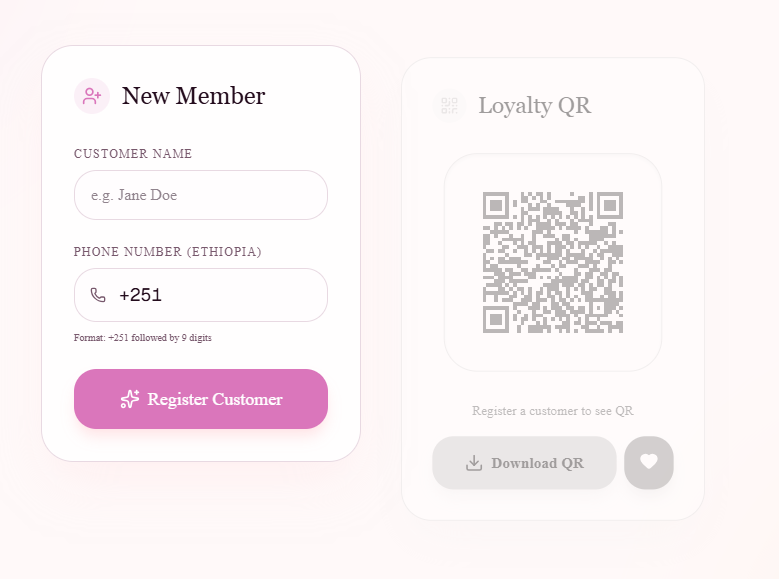
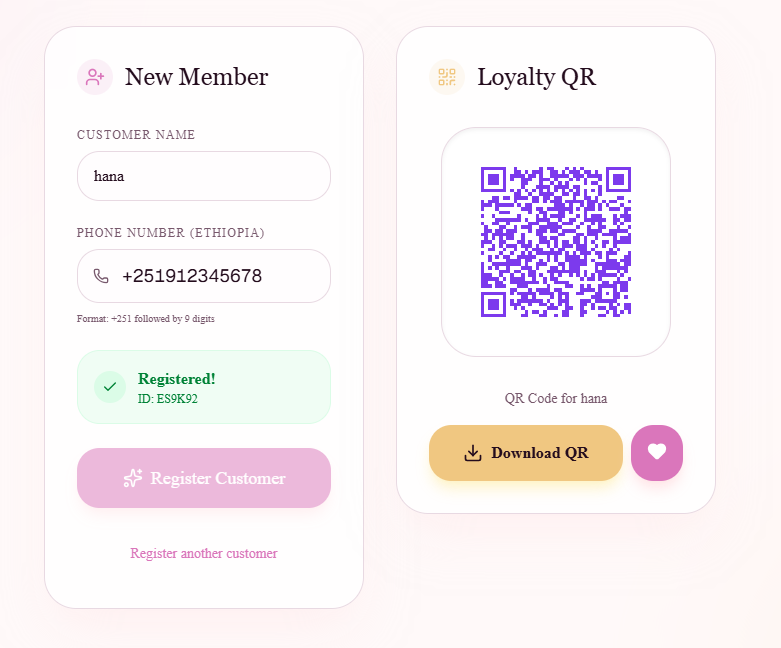
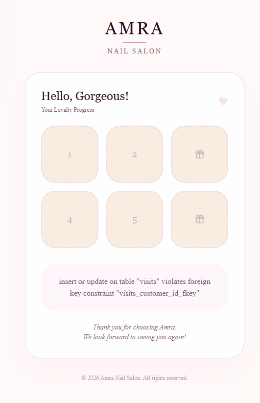
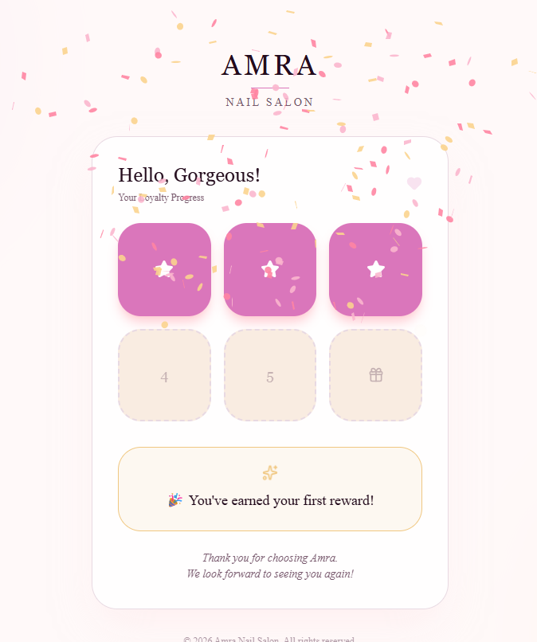
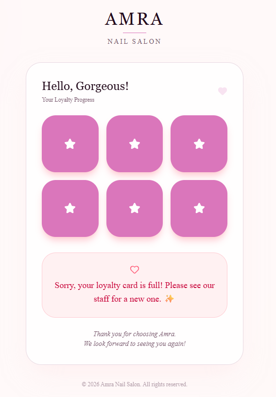

# 💳 Amra Nail Salon — Loyalty System

🔗[ **Live Demo:**](https://amra-loyalty-system.vercel.app/)  
📦[ **Source Code:** ](https://github.com/oritsamuel/loyalty-system)

A modern, staff-facing loyalty tracking system that replaces paper punch cards with a seamless digital experience.

Built with **Next.js** and **Supabase**, this app allows salon staff to register customers, track visits, and automatically reward loyalty through an interactive digital card system.

---

## 🚀 Key Features

### 🧾 Customer Registration

* Register new clients through a clean, intuitive interface
* Auto-generates a unique 6-character customer ID
* Ethiopian phone number validation (+251 format)



---

### 🔳 QR Code System

* Instantly generates a unique QR code per customer
* Links directly to their check-in page
* One-click download for easy sharing



---

### 🎟 Digital Loyalty Card

* Interactive 6-slot stamp card UI
* Real-time visit tracking
* Smooth animations and visual feedback



---

### 🎉 Reward System

* Automatic rewards at:

  * 3rd visit
  * 6th visit
* Includes celebratory animations (confetti)



---

### 🔁 Smart Card Logic

* Handles completed cards cleanly
* Ensures accurate tracking beyond 6 visits



---

## 🎯 Why I Built This

Many small service businesses still rely on physical loyalty cards, which are:

* Easy to lose
* Hard to track
* Not scalable

This project digitizes that experience into a **simple, reliable, and engaging system** that improves both staff workflow and customer retention.

---

## 🧠 What This Project Demonstrates

* Building real-world business systems with **Next.js**
* Designing clean, responsive **frontend interfaces**
* Managing state and user flows across multiple pages
* Integrating frontend with a backend service (Supabase)
* Creating polished UI with animations and feedback

---

## 🛠 Tech Stack

* **Frontend:** Next.js (App Router), React, Tailwind CSS
* **Backend:** Supabase
* **UI & Effects:** Lucide Icons, canvas-confetti

---

## ⚙️ Getting Started

```bash
npm install
npm run dev
```

---

## 🌍 Future Improvements

* Admin dashboard with analytics
* Customer search & filtering
* Role-based access (staff vs admin)
* Mobile-first optimizations

---

## 📌 Note

This system is designed for **internal staff use only** and is optimized for speed, simplicity, and usability in a real business environment.
