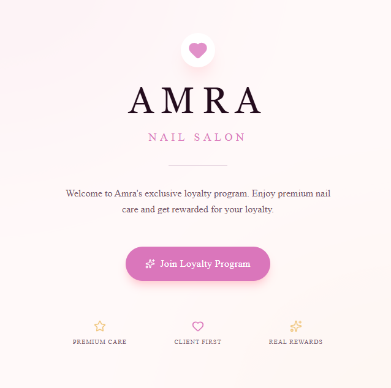

# Amra Nail Salon - Loyalty System

Welcome to the Amra Nail Salon Loyalty System! This project is a modern web application built with Next.js and Supabase, designed to reward loyal customers with a seamless, engaging experience. 

## 🎯 Purpose

The primary goal of this system is to manage and track customer visits for Amra Nail Salon's loyalty program. It replaces traditional paper punch cards with a sleek, digital alternative. Customers can easily be registered by the salon staff, receive a unique QR code, and track their progress towards rewards (such as a free service or discount) every time they check in.

## ✨ Features
- **Premium UI / UX**
  - High-end, fully responsive design built with Tailwind CSS.
  - Smooth micro-animations, glassmorphism styling, and a curated color palette that reflects a premium salon aesthetic.
    
  
  
- **Customer Registration**
  - Intuitive interface (`/register`) to enroll new clients.
  - Automatically generates a unique, 6-character alphanumeric ID for each customer.
  - Specifically designed to validate Ethiopian phone numbers (+251 format).
    

- **Instant QR Code Generation**
  - Upon registration, the system dynamically generates a unique QR code linking directly to the customer's personal check-in page.
  - One-click download feature to easily save or share the QR code with the customer.
    

- **Digital Loyalty Card & Check-in**
  - Dedicated check-in page (`/check-in?customerId=...`) that instantly processes and records visits.
  - A beautiful, interactive 6-slot digital stamp card.
    

  - **Rewards at Milestones:** Customers unlock special rewards on their 3rd and 6th visits, accompanied by exciting visual celebrations (confetti animations).
    

  - **Card Completion Logic:** The system elegantly handles full cards after the 6th visit, ensuring accurate progress tracking.
    

## 🛠️ Technology Stack

- **Frontend:** [Next.js](https://nextjs.org/) (App Router), [React](https://react.dev/), styled with [Tailwind CSS](https://tailwindcss.com/).
- **Backend & Database:** [Supabase](https://supabase.com/) for secure, real-time database management and API operations.
- **Assets & Effects:** [Lucide React](https://lucide.dev/) for scalable vector icons and `canvas-confetti` for celebratory animations.

